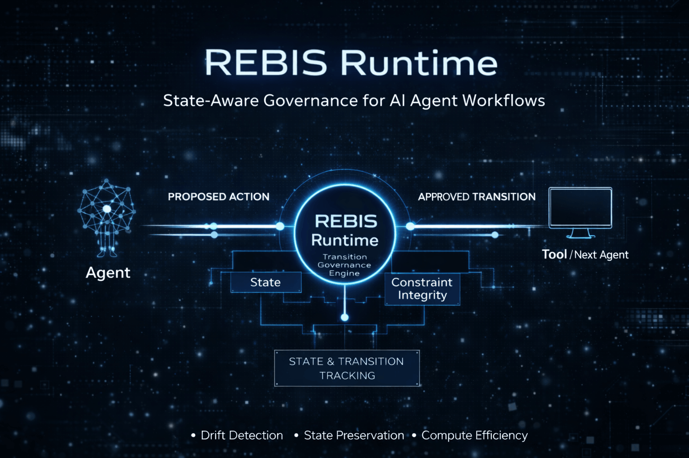

# REBIS

**State-aware orchestration runtime for long-horizon AI agent workflows.**

<p align="center">
  
</p>

> **Runtime governance for long-horizon AI agent pipelines.**  
> Prevents **reasoning drift**, preserves **task-state fidelity**, reduces **wasted computation**, and **builds better results**.

---

## Currently Building

**REBIS Runtime** — a governance layer for long-horizon AI agent systems.

Current focus:

- **policy-bound reasoning contracts**
- **transition validation**
- **task-state ledger design**
- **reasoning drift mitigation**
- **compute efficiency in agent workflows**

---

## Why REBIS Exists

Modern AI systems increasingly rely on multi-step reasoning, tool use, and agent collaboration.

As workflows grow longer and more autonomous, they tend to degrade through:

- **reasoning drift**
- **dropped constraints**
- **corrupted handoffs**
- **repeated self-correction loops**
- **wasted computation**

REBIS addresses this by governing the **transitions between reasoning stages** rather than simply trusting the workflow to remain stable on its own.

**Agents perform work. REBIS governs the workflow.**

---

## The Drift Problem

Long-horizon AI workflows degrade without structured transition governance.

### Without REBIS

```text
Agent → Agent → Agent → Agent
        ↓
   constraint loss
        ↓
   reasoning drift
        ↓
 repeated correction loops
        ↓
   wasted computation
With REBIS
Agent → REBIS → Agent → REBIS → Agent

Each transition is validated.

task-state preserved

constraints maintained

reasoning drift prevented

compute used efficiently

Architecture
Agent → Proposed Action → REBIS Runtime → Validated Transition → Tool / Next Agent

REBIS acts as a runtime governance layer between agents and tools.

Core runtime responsibilities:

transition validation

reasoning contract enforcement

task-state preservation

handoff integrity checks

minimal repair instead of full reruns

observability for workflow stability

Core Concepts
Policy-Bound Reasoning Contracts

Each workflow transition can be governed by a contract that defines:

the objective anchor

hard constraints

required state

allowed actions

expected output shape

failure policy

Task-State Fidelity

Critical task objectives and constraints remain consistent across workflow stages.

Reasoning Drift Prevention

REBIS detects and corrects deviations from the original objective during multi-step reasoning.

Transition Governance

All workflow transitions are validated before execution to ensure logical continuity.

Reduced Wasted Computation

By preventing broken state propagation, REBIS reduces repeated self-correction cycles and redundant work.

Handoff Validation

Agent-to-agent and agent-to-tool transitions are verified before execution.

Example Usage
const rebis = new RebisRuntime(config)

await rebis.run({
  objective: "Complete a long-horizon AI workflow",
  agents: [planner, researcher, executor]
})
```
Workflow Behavior

Agents propose actions

REBIS validates the transition

Task-state integrity is preserved

Computation is focused on solving the task

Status

REBIS is an experimental orchestration runtime exploring governance patterns for long-horizon AI workflows.

Current research focuses on:

agent workflow orchestration

transition validation systems

reasoning drift mitigation

reliable multi-agent collaboration

reasoning contract architecture

Future iterations will expand:

runtime capabilities

benchmarking frameworks

evaluation tooling for workflow reliability

deeper performance optimization

Key Ideas

AI Agent Orchestration

Reasoning Governance

Policy-Bound Reasoning Contracts

Multi-Agent Workflow Governance

Reasoning Drift Mitigation

Task-State Preservation

Compute Efficiency

Pinned Project

Rebis-AI-auditing-Architecture

Public prototype exploring runtime governance for long-horizon AI workflows. Your pinned repo currently describes Rebis as governing transitions between reasoning stages to prevent drift, enforce policy, and reduce wasted computation, so this profile README now mirrors that direction more closely.

Contributing

REBIS is an evolving research project exploring new approaches to reliable AI workflows.

Ideas, experiments, and improvements are welcome.

License

MIT License
